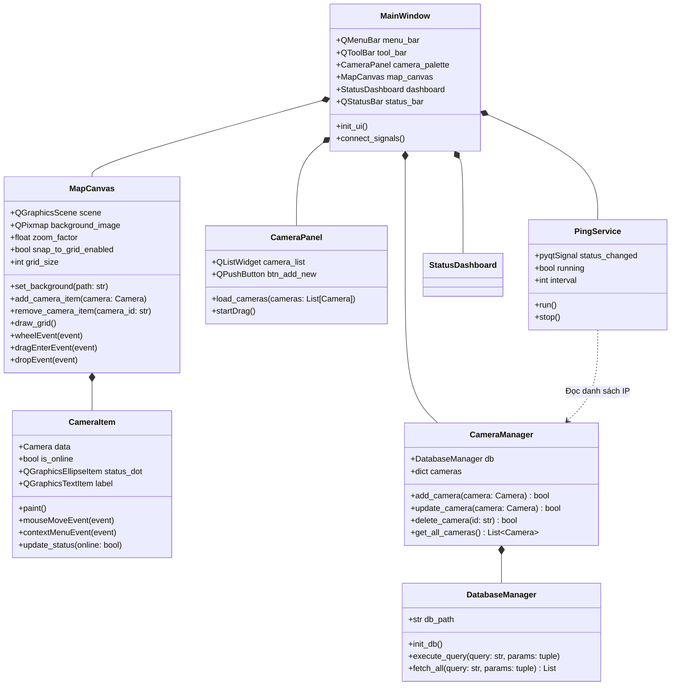
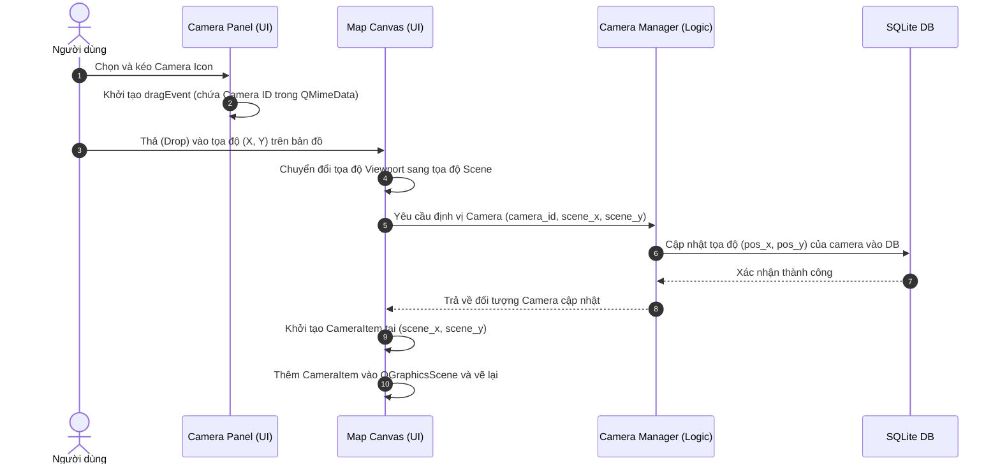

# KẾ HOẠCH PHÁT TRIỂN CHI TIẾT (DETAILED DEVELOPMENT PLAN)
## HỆ THỐNG QUẢN LÝ CAMERA TÍCH HỢP BẢN ĐỒ TRỰC QUAN (CAMERA MAP VIEW)

Tài liệu này chi tiết hóa lộ trình phát triển, kiến trúc hệ thống, cấu trúc dữ liệu, các thuật toán cốt lõi và kịch bản kiểm thử dựa trên bản phác thảo ban đầu trong [plan.md](file:///e:/Github/Camera-Map-View/plan.md).

---

## 1. KIẾN TRÚC HỆ THỐNG CHI TIẾT (SYSTEM ARCHITECTURE DETAILED)

Hệ thống được thiết kế theo mô hình **MVC (Model-View-Controller)** thích hợp cho ứng dụng desktop PyQt6. Sự phân tách trách nhiệm đảm bảo giao diện luôn mượt mà (không bị block bởi các tác vụ mạng) và dữ liệu được đồng bộ chính xác.

### 1.1 Sơ đồ lớp (Class Diagram)



### 1.2 Luồng tương tác kéo thả (Drag & Drop Sequence)



---

## 2. DATA MODELS VÀ THIẾT KẾ DATABASE CỤ THỂ

### 2.1 Python Data Models (`core/camera.py`)

Sử dụng thư viện `dataclasses` tiêu chuẩn để định nghĩa cấu trúc dữ liệu rõ ràng, dễ serialize.

```python
from dataclasses import dataclass, asdict
from datetime import datetime
from typing import Optional, List, Dict, Any

@dataclass
class Camera:
    id: str
    name: str
    ip_address: str
    port: int = 554
    camera_type: str = "Fixed"  # Fixed, PTZ, Dome, Fisheye
    position_x: float = 0.0
    position_y: float = 0.0
    rotation: float = 0.0       # Góc quay của camera (0-360 độ)
    status: bool = False        # Online/Offline
    last_check: Optional[datetime] = None
    notes: str = ""

    def to_dict(self) -> Dict[str, Any]:
        data = asdict(self)
        if self.last_check:
            data['last_check'] = self.last_check.isoformat()
        return data

    @classmethod
    def from_dict(cls, data: Dict[str, Any]) -> 'Camera':
        last_check = data.get('last_check')
        if last_check:
            data['last_check'] = datetime.fromisoformat(last_check)
        return cls(**data)


@dataclass
class DrawingShape:
    id: str
    shape_type: str            # Line, Rectangle, Ellipse, Polygon
    points: List[float]        # Tọa độ [x1, y1, x2, y2, ...]
    color: str = "#FF0000"     # Mã màu hex
    line_thickness: int = 2
    label: str = ""
```

### 2.2 Sơ đồ cơ sở dữ liệu SQLite (`core/db_manager.py`)

Để lưu trữ bền vững, chúng ta dùng SQLite tích hợp sẵn trong Python. File CSDL mặc định sẽ là `assets/data/camera_manager.db`.

```sql
-- Bảng lưu thông tin các sơ đồ/bản vẽ mặt bằng
CREATE TABLE IF NOT EXISTS map_layouts (
    id TEXT PRIMARY KEY,
    name TEXT NOT NULL,
    background_path TEXT NOT NULL,
    grid_size INTEGER DEFAULT 20,
    created_at TIMESTAMP DEFAULT CURRENT_TIMESTAMP,
    updated_at TIMESTAMP DEFAULT CURRENT_TIMESTAMP
);

-- Bảng lưu trữ thông tin camera chi tiết
CREATE TABLE IF NOT EXISTS cameras (
    id TEXT PRIMARY KEY,
    layout_id TEXT,
    name TEXT NOT NULL,
    ip_address TEXT NOT NULL,
    port INTEGER DEFAULT 554,
    camera_type TEXT DEFAULT 'Fixed',
    pos_x REAL DEFAULT 0.0,
    pos_y REAL DEFAULT 0.0,
    rotation REAL DEFAULT 0.0,
    notes TEXT,
    FOREIGN KEY (layout_id) REFERENCES map_layouts(id) ON DELETE CASCADE
);

-- Bảng lưu các hình vẽ tự do trên bản đồ (Zones/Lines)
CREATE TABLE IF NOT EXISTS drawing_shapes (
    id TEXT PRIMARY KEY,
    layout_id TEXT NOT NULL,
    shape_type TEXT NOT NULL,
    points TEXT NOT NULL, -- Chuỗi JSON lưu list tọa độ
    color TEXT DEFAULT '#FF0000',
    line_thickness INTEGER DEFAULT 2,
    label TEXT,
    FOREIGN KEY (layout_id) REFERENCES map_layouts(id) ON DELETE CASCADE
);

-- Bảng lưu lịch sử ping (dùng cho phân tích thống kê)
CREATE TABLE IF NOT EXISTS ping_history (
    id INTEGER PRIMARY KEY AUTOINCREMENT,
    camera_id TEXT NOT NULL,
    timestamp TIMESTAMP DEFAULT CURRENT_TIMESTAMP,
    is_online INTEGER NOT NULL,
    latency REAL,
    FOREIGN KEY (camera_id) REFERENCES cameras(id) ON DELETE CASCADE
);
```

---

## 3. CHI TIẾT CÁC GIAI ĐOẠN TRIỂN KHAI (IMPLEMENTATION STEPS)

### GIAI ĐOẠN 1: Thiết lập & Khung Giao diện Chính (Zoom & Pan Canvas)
*Thời gian thực hiện: Ngày 1-2*

1. **Khởi tạo môi trường ảo Python & Cài đặt Dependencies**:
   ```bash
   python -m venv .venv
   .venv\Scripts\activate
   pip install PyQt6 Pillow ping3 aiohttp opencv-python pytest
   pip freeze > requirements.txt
   ```
2. **Thiết lập Canvas đồ họa (`ui/map_canvas.py`)**:
   - Thừa kế từ `QGraphicsView` để dựng một canvas có khả năng zoom và pan mượt mà.
   - **Tác vụ Zoom**: Override hàm `wheelEvent` để tính toán scale factor (giới hạn zoom từ `0.15x` đến `5.0x`).
     ```python
     def wheelEvent(self, event):
         zoom_in_factor = 1.25
         zoom_out_factor = 0.8
         # Lưu vị trí trỏ chuột trước khi zoom để giữ nguyên tâm zoom tại chuột
         old_pos = self.mapToScene(event.position().toPoint())
         
         if event.angleDelta().y() > 0:
             factor = zoom_in_factor
         else:
             factor = zoom_out_factor
             
         self.scale(factor, factor)
         new_pos = self.mapToScene(event.position().toPoint())
         
         # Điều chỉnh scrollbar để giữ nguyên điểm dưới chuột
         delta = new_pos - old_pos
         self.translate(delta.x(), delta.y())
     ```
   - **Tác vụ Pan (Kéo bản đồ)**: Sử dụng chuột giữa hoặc nhấn giữ phím Space + kéo chuột trái. Ta thiết lập `QGraphicsView.DragMode.ScrollHandDrag`.
3. **Load Ảnh nền Bản đồ**:
   - Sử dụng `QGraphicsPixmapItem` để thêm ảnh mặt bằng công ty vào `QGraphicsScene`.
   - Cung cấp tính năng fit bản đồ tự động vào kích thước cửa sổ hiển thị ban đầu.

---

### GIAI ĐOẠN 2: Kéo & Thả (Drag & Drop) và Hiển thị Camera
*Thời gian thực hiện: Ngày 3-4*

1. **Camera Panel Sidebar (`ui/camera_panel.py`)**:
   - Sử dụng `QListWidget` hiển thị danh sách các camera chưa được định vị trên bản đồ.
   - Bật tính năng Drag bằng cách thiết lập:
     ```python
     self.setDragEnabled(True)
     self.setDragDropMode(QAbstractItemView.DragDropMode.DragOnly)
     ```
   - Override hàm `startDrag` để gói ID của camera vào đối tượng `QMimeData` với định dạng `"application/x-camera-id"`.
2. **Map Canvas Drop Handling (`ui/map_canvas.py`)**:
   - Cấu hình Canvas chấp nhận drop: `self.setAcceptDrops(True)`.
   - Override `dragEnterEvent` và `dragMoveEvent` để lọc đúng kiểu MIME dữ liệu:
     ```python
     def dragEnterEvent(self, event):
         if event.mimeData().hasFormat("application/x-camera-id"):
             event.acceptProposedAction()
     ```
   - Override `dropEvent`:
     - Lấy tọa độ pixel từ `event.position()`.
     - Dùng `self.mapToScene(pixel_pos)` để quy đổi sang tọa độ đồ họa của Scene.
     - Phát tín hiệu (signal) `camera_dropped(camera_id, scene_x, scene_y)` về MainWindow xử lý logic lưu trữ và render.
3. **Camera Item Đồ Họa (`ui/camera_item.py`)**:
   - Kế thừa từ `QGraphicsItem` (hoặc `QGraphicsPixmapItem`).
   - Thiết lập các Flag đồ họa:
     - `QGraphicsItem.GraphicsItemFlag.ItemIsMovable` (Cho phép kéo thả trực tiếp để di chuyển camera trên bản đồ).
     - `QGraphicsItem.GraphicsItemFlag.ItemIsSelectable` (Cho phép click chọn).
     - `QGraphicsItem.GraphicsItemFlag.ItemSendsGeometryChanges` (Báo hiệu khi tọa độ thay đổi để cập nhật DB).
   - Override hàm `paint` để vẽ:
     - Biểu tượng camera (dùng SVG hoặc ký tự icon SVG vẽ bằng `QPainterPath`).
     - Một chấm tròn nhỏ thể hiện trạng thái (Xanh lá = Online, Đỏ = Offline).
     - Góc quét của camera (vẽ hình quạt mờ xung quanh camera dựa trên thuộc tính `rotation`).

---

### GIAI ĐOẠN 3: Quản lý CRUD Camera và Tích hợp SQLite
*Thời gian thực hiện: Ngày 5-6*

1. **Xây dựng Database Manager (`core/db_manager.py`)**:
   - Sử dụng mẫu thiết kế Singleton để duy trì một kết nối SQLite an toàn duy nhất.
   - Viết các câu lệnh khởi tạo bảng nếu chưa tồn tại.
2. **Camera Manager (`core/camera_manager.py`)**:
   - Triển khai các hàm nghiệp vụ CRUD:
     - `add_camera(camera: Camera) -> bool`: Validate IP trùng, thêm vào DB.
     - `update_camera_position(camera_id: str, x: float, y: float) -> bool`.
     - `update_camera_details(camera: Camera) -> bool`.
     - `delete_camera(camera_id: str) -> bool`.
3. **Hộp thoại Thuộc tính (`ui/property_dialog.py`)**:
   - Thiết kế giao diện kế thừa `QDialog` để chỉnh sửa thông số camera:
     - Tên camera, IP Address (sử dụng `QRegularExpressionValidator` với regex IP v4 chuẩn).
     - Cổng port RTSP (mặc định 554).
     - Loại camera (ComboBox: Fixed, PTZ, Dome).
     - Góc quay Rotation (Slider/Spinbox từ 0 đến 359 độ).
     - Ghi chú bổ sung.

---

### GIAI ĐOẠN 4: Công cụ Vẽ Hình học & Snap-to-Grid
*Thời gian thực hiện: Ngày 7-8*

1. **Thuật toán Snap-to-Grid**:
   - Khi di chuyển `CameraItem`, tính toán tọa độ làm tròn dựa trên kích thước lưới `grid_size`.
     ```python
     def snap_to_grid(x, y, grid_size):
         snapped_x = round(x / grid_size) * grid_size
         snapped_y = round(y / grid_size) * grid_size
         return snapped_x, snapped_y
     ```
   - Cập nhật tọa độ mới của item về lưới trong sự kiện `itemChange` của `CameraItem` khi flag `ItemPositionChange` được kích hoạt.
2. **Công cụ Vẽ Đồ Họa (Drawing Tools)**:
   - Thêm thanh công cụ chứa các chế độ: `Select` (Mặc định), `Draw Line`, `Draw Rectangle`, `Draw Zone` (Polygon).
   - Khi chọn chế độ vẽ, canvas tạm thời tắt chế độ Pan/Move camera. Override `mousePressEvent`, `mouseMoveEvent`, `mouseReleaseEvent` để vẽ các nét vẽ tạm thời (Preview lines/rectangles).
   - Khi nhấc chuột, chuyển nét vẽ tạm thời thành `QGraphicsLineItem` hoặc `QGraphicsPolygonItem` chính thức, tạo đối tượng `DrawingShape` tương ứng và lưu trữ.

---

### GIAI ĐOẠN 5: Tiến trình Ping Ngầm (Background Network Monitor)
*Thời gian thực hiện: Ngày 8-9*

Để tránh hiện tượng đóng băng giao diện người dùng (GUI freezing) khi kiểm tra kết nối mạng (thao tác I/O blocking), tiến trình Ping bắt buộc chạy trong một Thread riêng biệt.

> [!NOTE]
> Vì ứng dụng chỉ quản lý các camera nội bộ, yêu cầu tối thiểu và quan trọng nhất là thiết bị có khả năng phản hồi (ping hoặc kiểm tra cổng dịch vụ) trong phạm vi mạng LAN nội bộ. Hệ thống không cần và không nên kiểm tra các liên kết mạng Internet bên ngoài.

1. **Lớp dịch vụ Ping Service (`core/ping_service.py`)**:
   - Kế thừa từ `QThread`.
   - Sử dụng thư viện `ping3` để gửi gói tin ICMP Ping trong mạng LAN.
   - Do ping cần quyền admin trên một số HĐH, ta triển khai cơ chế kiểm tra dự phòng (Fallback check) qua mở socket TCP nhanh tới cổng RTSP (554) hoặc HTTP (80/8000) của camera trong mạng nội bộ nếu ICMP ping bị từ chối hoặc thất bại.
2. **Triển khai Code của `PingService`**:
   ```python
   import socket
   from PyQt6.QtCore import QThread, pyqtSignal
   from ping3 import ping
   
   class PingService(QThread):
       # Tín hiệu báo trạng thái kết nối của một camera
       # Gửi: (camera_id, is_online, latency_ms)
       status_updated = pyqtSignal(str, bool, float)
       
       def __init__(self, db_manager, interval_seconds=30):
           super().__init__()
           self.db = db_manager
           self.interval = interval_seconds
           self.is_running = True
           
       def stop(self):
           self.is_running = False
           self.wait()
           
       def check_ping(self, ip: str) -> Optional[float]:
           try:
               # Trả về thời gian delay tính bằng giây, hoặc None nếu timeout
               delay = ping(ip, timeout=1.0)
               if delay is not None:
                   return delay * 1000.0  # chuyển sang ms
           except Exception:
               pass
           return None
           
       def check_tcp_port(self, ip: str, port: int) -> bool:
           try:
               with socket.socket(socket.AF_INET, socket.SOCK_STREAM) as s:
                   s.settimeout(1.0)
                   result = s.connect_ex((ip, port))
                   return result == 0
           except Exception:
               return False
               
       def run(self):
           while self.is_running:
               # Đọc danh sách IP từ database thông qua DB manager
               cameras = self.db.get_all_cameras_for_ping() 
               for cam in cameras:
                   if not self.is_running:
                       break
                   
                   # Bước 1: Thử Ping bằng ICMP
                   latency = self.check_ping(cam['ip_address'])
                   is_online = latency is not None
                   
                   # Bước 2: Nếu ping thất bại, thử TCP Connect tới port RTSP/HTTP
                   if not is_online:
                       is_online = self.check_tcp_port(cam['ip_address'], cam['port'])
                       latency = 0.0 if is_online else -1.0
                       
                   # Phát tín hiệu báo kết quả
                   self.status_updated.emit(cam['id'], is_online, latency)
                   
               # Chờ đến chu kỳ quét tiếp theo
               self.msleep(self.interval * 1000)
   ```
3. **Kết nối tín hiệu trên UI (`ui/main_window.py`)**:
   - Kết nối `status_updated` từ thread con đến hàm slot của main window.
   - Cập nhật thuộc tính `is_online` của `CameraItem` tương ứng trên bản đồ.
   - Cập nhật số liệu trên Status Dashboard (Tổng số, Online, Offline).
   - Lưu trữ lịch sử ping vào bảng `ping_history` trong SQLite một cách bất tuần tự (async/batch) để tránh ảnh hưởng hiệu năng.

---

### GIAI ĐOẠN 6: Đánh bóng, Kiểm thử & Tối ưu hóa
*Thời gian thực hiện: Ngày 9-10*

1. **Xử lý Ngoại lệ & Phòng ngừa lỗi**:
   - Nếu file ảnh nền bản đồ bị xóa hoặc lỗi, ứng dụng hiển thị bản đồ mặc định trống với lưới màu xám cùng thông báo lỗi.
   - Xác thực đầu vào chặt chẽ ở các biểu mẫu: IP không hợp lệ sẽ hiển thị viền đỏ cảnh báo và khóa nút Lưu.
2. **Kiểm thử tự động (`tests/`)**:
   - Viết các test case unit cho các module logic nghiệp vụ bằng thư viện `pytest`.
   - Test CRUD logic của `CameraManager`.
   - Test hàm xử lý `snap_to_grid`.
   - Mocking tác vụ mạng của PingService để đảm bảo hoạt động độc lập và không phụ thuộc vào hạ tầng mạng thực tế khi chạy test suite.
3. **Tối ưu hóa hiệu năng**:
   - Sử dụng `QGraphicsView.OptimizationFlag.DontSaveViewportStates` và `DontAdjustFlickerFreeUpdates` để tăng tốc độ vẽ lại.
   - Chỉ cập nhật giao diện `CameraItem` khi trạng thái thực sự thay đổi để tránh vẽ lại không cần thiết.

---

## 4. UI/UX DESIGN SPECIFICATION

Ứng dụng hướng tới sự chuyên nghiệp, hiện đại, hỗ trợ chế độ Dark Mode mặc định để giảm mỏi mắt cho nhân viên trực giám sát.

### 4.1 Bảng màu ứng dụng (Dark Theme QSS - HSL Tailored)

| Thành phần | Mã Màu | Vai trò |
|---|---|---|
| Background Chính | `#121214` | Màu nền chính của ứng dụng |
| Sidebar / Panels | `#1a1a1e` | Nền của danh sách camera và thuộc tính |
| Border | `#2d2d34` | Viền ngăn cách giữa các khu vực |
| Accent Primary | `#3b82f6` | Màu xanh lam nổi bật (nút bấm chính, selection) |
| Online Indicator | `#10b981` | Màu xanh lục thể hiện Camera Online |
| Offline Indicator | `#ef4444` | Màu đỏ thể hiện Camera Offline |
| Text Primary | `#f3f4f6` | Màu chữ chính (Độ tương phản cao) |
| Text Secondary | `#9ca3af` | Màu chữ phụ, chú thích, placeholder |

### 4.2 Thiết kế chi tiết CameraItem trên bản đồ

```
        ┌─────────────────────────┐  -> Vòng tròn đứt nét hiển thị
     ░░░│░░░                      │     vùng quét (FOV) nếu camera được chọn
   ░░   │   ░░                    │
  ░     │     ░                   │
 ░   🟢 │      ░                  │  -> Chấm tròn màu Trạng thái (Online/Offline)
 ░  [ 📹 ]     ░                  │  -> Biểu tượng Camera (QPainterPath vẽ sắc nét)
 ░  Cam_01     ░                  │  -> Label hiển thị tên Camera (Ẩn/Hiện linh hoạt)
  ░     │     ░                   │
   ░░   │   ░░                    │
     ░░░│░░░                      │
        └─────────────────────────┘
```

- Khi người dùng di chuột vào camera: Hiển thị tooltip dạng popup chứa: IP, Port, Vị trí lắp đặt, Trạng thái (RTT latency), và Thời gian quét cuối cùng.
- Nhấp đúp chuột vào camera: Mở hộp thoại `PropertyDialog` để chỉnh sửa nhanh.
- Chuột phải: Hiển thị context menu nhanh với 3 tùy chọn:
  1. *Chỉnh sửa thông số (Properties)*
  2. *Xoay hướng camera (Rotate 90°/180°/Custom)*
  3. *Xóa khỏi bản đồ (Delete)*

---

## 5. KẾ HOẠCH KIỂM THỬ VÀ ĐẢM BẢO CHẤT LƯỢNG (TESTING & QA PLAN)

Chúng ta áp dụng quy trình kiểm thử nghiêm ngặt để đảm bảo phần mềm hoạt động ổn định và chính xác.

### 5.1 Kiểm thử tự động (Automated Tests)

Chạy test suite bằng pytest:
```bash
pytest tests/
```

Các ca kiểm thử cần viết mã kiểm thử tự động gồm:

1. **Test logic mô hình Camera (`tests/test_camera_model.py`)**:
   - Kiểm tra khởi tạo đối tượng Camera với các giá trị mặc định.
   - Kiểm tra quá trình chuyển đổi qua lại giữa dictionary và đối tượng Camera (`to_dict` / `from_dict`).
2. **Test quản lý CSDL (`tests/test_camera_manager.py`)**:
   - Khởi tạo DB tạm thời trong bộ nhớ (`:memory:`).
   - Kiểm tra thêm camera mới thành công.
   - Kiểm tra chặn lỗi thêm camera có IP trùng lặp.
   - Kiểm tra cập nhật tọa độ camera và xác minh lưu thành công.
3. **Test thuật toán Snap-to-Grid (`tests/test_geometry.py`)**:
   - Truyền vào các tọa độ lẻ (ví dụ: `x=23.4`, `y=47.9` với `grid_size=20`), kiểm tra kết quả làm tròn về đúng `x=20.0`, `y=40.0`.
   - Kiểm tra các trường hợp biên và kích thước lưới tùy chỉnh khác nhau.

### 5.2 Kiểm thử thủ công (Manual Verification Checklist)

Trước khi đóng gói bàn giao, lập trình viên và QA phải tích các ô kiểm dưới đây:

*   [ ] **Load bản đồ**: Ứng dụng tải thành công tệp ảnh PNG/JPG lớn (trên 10MB) mà không bị treo hay tràn bộ nhớ.
*   [ ] **Zoom & Pan**: Phóng to thu nhỏ bằng chuột hoạt động mượt mà, tâm phóng to bám sát trỏ chuột.
*   [ ] **Drag & Drop**: Kéo camera từ sidebar thả lên bản đồ hiển thị đúng icon tại vị trí thả chuột.
*   [ ] **Save & Reload**: Đóng ứng dụng và mở lại, kiểm tra các camera trên bản đồ giữ nguyên vị trí, góc xoay và thông tin thuộc tính.
*   [ ] **Chạy đa luồng**: Tắt/bật kết nối mạng thực tế, kiểm tra giao diện không bị giật/đơ trong quá trình Ping Service quét cập nhật trạng thái camera.

---

## 6. KẾ HOẠCH BẢO MẬT & QUẢN TRỊ RỦI RO (SECURITY & RISK)

### 6.1 Bảo mật dữ liệu mạng (Zero-Trust & Validation)
- **Input Validation**: Lọc sạch mọi dữ liệu đầu vào. Ngăn chặn các ký tự SQL Injection trong ô Tên và Ghi chú bằng cách dùng Parameterized Query (`sqlite3` binding) trong toàn bộ mã nguồn SQLite.
- **RTSP Endpoint Safety**: Hạn chế ứng dụng truy cập trực tiếp các luồng stream camera bên ngoài phạm vi IP mạng nội bộ (mạng LAN doanh nghiệp).
- **LAN Isolation & Focus**: Mọi kết nối kiểm tra trạng thái và luồng dữ liệu (nếu có) được giới hạn hoàn toàn trong mạng cục bộ (LAN), không thiết lập kết nối ra ngoài Internet để đảm bảo tính cô lập và bảo mật tối đa cho hệ thống camera nội bộ.

### 6.2 Quản trị rủi ro phát triển
- **Milestone Backup**: Cam kết thực hiện commit mã nguồn theo từng giai đoạn hoàn thành (tương ứng 6 Phase). Đặt tên commit rõ ràng, ví dụ: `feat: implement drag-and-drop mechanism for camera positioning`.
- **Phòng chống thảm họa mất dữ liệu (Disaster Recovery)**: Triển khai tính năng tự động sao lưu CSDL dự phòng (`camera_manager.db.bak`) mỗi lần khởi chạy ứng dụng.
